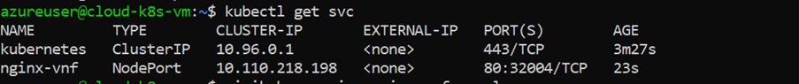
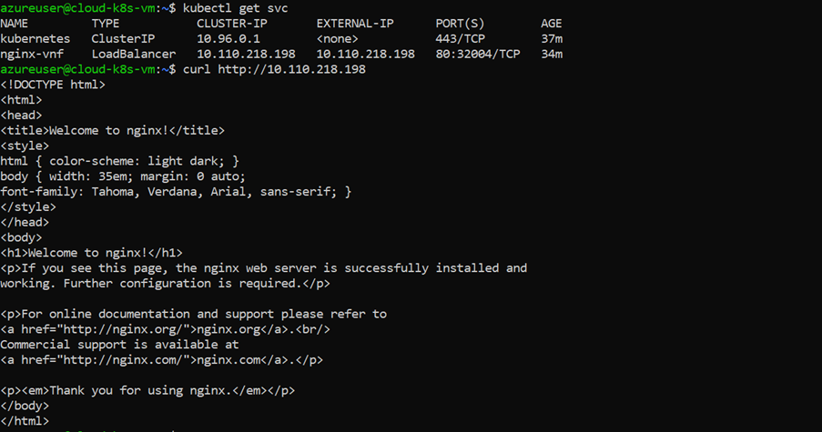
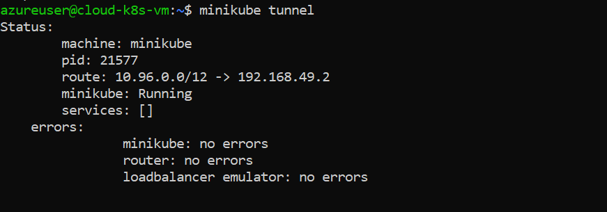
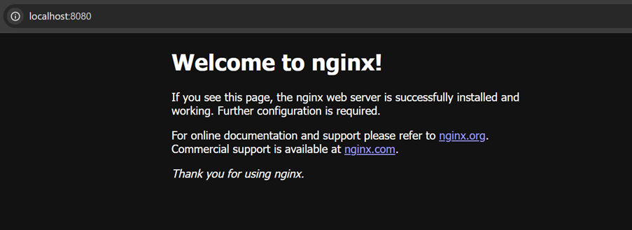
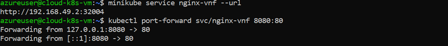
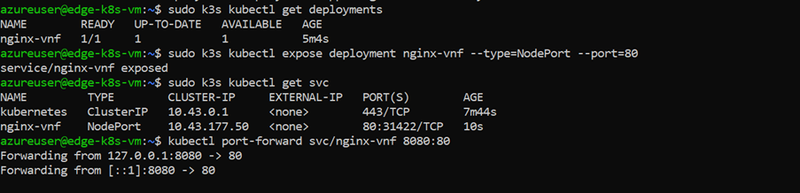
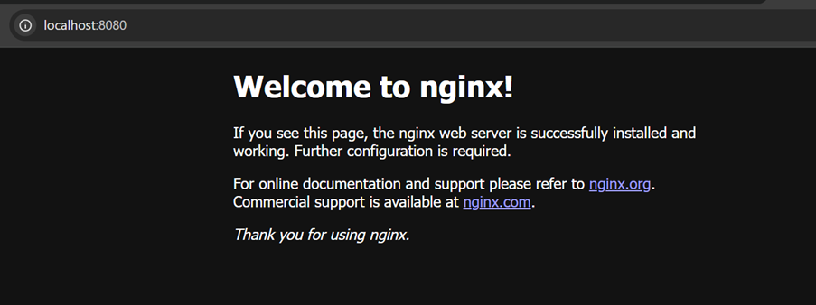

# Coursework 2 - Kubernetes for Cloud and Edge Network Functions

This repository contains scripts, screenshots, and troubleshooting documentation developed during the COMP5123M coursework.  
The goal of the experiment was to deploy a simple network function (Nginx container) in two different Kubernetes environments:

- **Cloud-like environment:** Minikube
- **Edge-like environment:** K3s

The deployments were tested to verify service accessibility and basic Kubernetes functionality.

---

# Repository Structure
cw-k8s-scripts
│
├── cloud_vm_commands.sh
├── edge_vm_commands.sh
├── GenAI_troubleshooting.md
├── README.md
└── screenshots
    ├── cloud-minikube-get-svc-nodeport.png
    ├── cloud-minikube-loadbalancer-svc.png
    ├── cloud-minikube-nginx-loadbalancer-browser.png
    ├── cloud-minikube-tunnel.png
    ├── cloud-nginx-portforward-terminal.png
    ├── edge-k8s-browser-nginx.png
    └── edge-k8s-terminal-deploy-svc-portforward.png

---

# Cloud Environment (Minikube)

A cloud-like Kubernetes environment was created using **Minikube**.  
The Nginx container was deployed and exposed using both **NodePort** and **LoadBalancer** services.

## Checking the NodePort service

This command verifies that the Nginx service was created successfully.

---

## LoadBalancer service configuration

A LoadBalancer service was created to expose the Nginx application externally.

---

## Running Minikube tunnel

Since Minikube does not provide a real cloud load balancer, the `minikube tunnel` command was used to simulate LoadBalancer functionality.

---

## Accessing the Nginx service from the browser

The Nginx welcome page confirms that the deployment and service configuration worked correctly.

---

## Port forwarding test

Port forwarding was also tested to verify that the application could be accessed locally.

---

# Edge Environment (K3s)

For the edge environment, **K3s** was used because it is a lightweight Kubernetes distribution designed for edge computing.

The same Nginx container deployment was created in this environment.

---

## Deployment and port forwarding

The deployment and service were created successfully in the K3s cluster, and port forwarding was used to access the service.

---

## Browser verification

The Nginx welcome page confirms that the application is running correctly in the edge environment.

---

# Scripts

Two scripts were created to document the commands used during the setup process.

### cloud_vm_commands.sh
Contains commands used to:
- Install and configure Minikube
- Deploy the Nginx container
- Create Kubernetes services
- Test service accessibility

### edge_vm_commands.sh
Contains commands used to:
- Install and configure K3s
- Deploy the Nginx container
- Create services
- Test the deployment using port forwarding

---

# GenAI Troubleshooting

GenAI tools were used **only in a limited troubleshooting role** to help understand certain configuration issues and error messages.

Examples include:
- Resolving K3s kubeconfig permission issues
- Understanding how to expose services in Minikube

All troubleshooting cases are documented in the file:
GenAI_troubleshooting.md

---

# Summary

This experiment demonstrated how the same containerized network function can be deployed in both cloud and edge Kubernetes environments.

Key observations:

- Minikube requires additional steps such as `minikube tunnel` to simulate LoadBalancer functionality.
- K3s provides a lightweight Kubernetes environment suitable for edge deployments.
- The same containerized application can run in both environments with minimal configuration changes.

---

# Author

Sapna Kamble  
qvlv0145@leeds.ac.uk
COMP5123M Coursework
